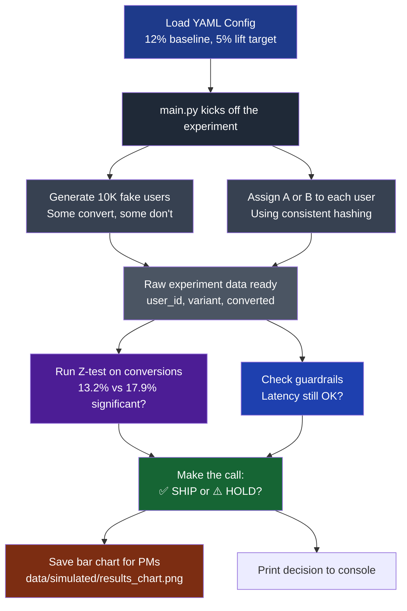

# AB-Engine: A Statistical Experimentation Framework

## Overview

AB-Engine is a lightweight, production-style A/B testing engine that automates the full experimentation lifecycle: from power analysis and deterministic user assignment to statistical inference, guardrail checks, and a final “ship / don’t ship” recommendation. It encodes objective decision rules and guardrails so experiment outcomes are consistent, reproducible, and aligned with both user experience and revenue goals.

## Key Features

- Deterministic, stateless user assignment using salted SHA-256 hashing to prevent bucket jumping.
- End-to-end experiment pipeline driven from a single YAML config file.
- Built-in power analysis and sample-size calculation for binary conversion experiments.
- Two-sample Z-test engine for proportions with confidence intervals and significance flags.
- Multi-metric guardrail logic (e.g., latency) to prevent harmful rollouts despite positive lift.
- Automated simulation of user traffic and conversion events for testing and demos.
- Visual reporting (conversion bar charts) saved to disk for stakeholder-ready communication.

## Repository Structure

```text
.
├── main.py                     # Orchestrates full experiment lifecycle
├── requirements.txt            # Dependencies
├── .gitignore
├── config/
│   └── experiment_config.yaml  # Experiment parameters and environment config
├── src/
│   └── engine/
│       ├── randomization.py    # Deterministic hashing-based variant assignment
│       ├── stats.py            # Statistical tests, power analysis, CI logic
│       └── simulator.py        # Synthetic traffic and conversion data generator
├── notebooks/
│   └── 01_walkthrough.ipynb    # E2E walkthrough and EDA
└── data/
    └── simulated/
        ├── *.csv               # Simulated experiment datasets
        └── results_chart.png   # Auto-generated visual report
```

## Architecture



## Experiment Configuration

Experiments are defined declaratively via YAML, keeping the engine flexible and code-free for most changes:

```yaml
experiment_name: "google_ads_conversion_test_2026"
parameters:
  baseline_value: 0.12       # 12% baseline conversion
  mde: 0.05                  # 5% Minimum Detectable Effect
  alpha: 0.05                # 95% Confidence Level
  power: 0.80                # 80% Statistical Power
```

The engine reads this configuration to:

- Compute required sample size for an A/B test on conversion rate.
- Simulate traffic and conversions consistent with the baseline and MDE.
- Run statistical inference and produce a decision.

Guardrail parameters are currently defined in code and passed into the decision logic as structured inputs.

## How It Works (End-to-End Flow)

1. **Configuration Load**
   - `main.py` loads `config/experiment_config.yaml` and extracts baseline conversion, MDE, alpha, and power.

2. **Power Analysis**
   - `stats.py` computes the required sample size per variant for a two-sample Z-test on proportions.

3. **Simulation**
   - `simulator.py` generates a flat population of \(N\) users.
   - For each user, it simulates conversion outcomes for control and treatment using `np.random.binomial`, capturing realistic sampling variance.

4. **Deterministic Assignment**
   - `randomization.py` assigns each user to variant “A” or “B” using salted SHA-256 hashing:
     - Hash `(user_id, experiment_id)` → float in \([0, 1)\).
     - `< 0.5` → “A”; otherwise → “B”.
   - This ensures stable, stateless assignments with no bucket jumping.

5. **Statistical Inference**
   - `stats.py` aggregates conversions by variant and computes:
     - `p_a`, `p_b` (conversion rates).
     - Relative lift.
     - Two-sample Z-test p-value.
     - Confidence interval for the difference.
     - `significant: bool` flag.

6. **Guardrail Evaluation**
   - A list of guardrail metrics and their observed impacts is passed into a decision function.
   - Hardcoded rule: block “Ship” if any guardrail shows a significant negative impact worse than -2%.

7. **Decision Engine**
   - Combines:
     - Primary metric significance.
     - Guardrail outcomes.
   - Returns a human-readable recommendation, such as:
     - `✅ SHIP: Statistically Significant Gain with Safe Guardrails`
     - `⚠️ HOLD: Positive Lift but Guardrail Violation`
     - `❌ DO NOT SHIP: No Significant Improvement`

8. **Reporting**
   - Generates a conversion bar chart with Google-style colors (e.g., `#4285F4`).
   - Annotates bars with exact conversion percentages for A and B.
   - Saves the chart to `data/simulated/results_chart.png`.

## Deterministic Randomization

**File:** `src/engine/randomization.py`  

Interface:

```python
def get_variant(user_id: str, exp_id: str) -> str:
    ...
```

Key points:

- Concatenates `user_id` and `exp_id`, hashes with SHA-256, and maps the hash to a float in \([0, 1)\).
- For classic A/B:
  - `< 0.5` → “A”
  - `>= 0.5` → “B”
- The design supports extension to \(n\) variants by partitioning \([0, 1)\) into \(n\) intervals (e.g., 0–0.33, 0.33–0.66, 0.66–1.0).

Benefits:

- Stateless: no need to store assignments.
- Stable across reruns and environments.
- Prevents accidental bucket switching.

## Statistical Engine

**File:** `src/engine/stats.py`  

Capabilities:

- Focused on binary conversion metrics (proportions).
- Uses `scipy.stats` to implement:
  - Two-sample Z-test for proportions.
  - Confidence intervals for the difference in conversion rates.
  - Pre-test power analysis and sample-size computation.

Typical return object:

```python
{
  "p_a": float,          # conversion rate in control
  "p_b": float,          # conversion rate in treatment
  "lift": float,         # relative lift
  "p_value": float,
  "ci": (float, float),  # confidence interval for difference
  "significant": bool    # True if p_value < alpha
}
```

Scope:

- Single primary metric (e.g., conversion rate).
- Multiple secondary metrics used as guardrails, not as additional formal hypothesis tests.

## Simulation Engine

**File:** `src/engine/simulator.py`  

Features:

- Configurable:
  - Baseline conversion rate (from YAML).
  - Target uplift (MDE).
  - Total sample size.
- Generates:
  - Flat population of \(N\) user IDs.
  - Variant assignments via `get_variant`.
  - Conversion outcomes using `np.random.binomial` for realistic variance.

This enables validating the pipeline and demonstrating behavior under different baseline and uplift assumptions.

## Guardrails & Decision Logic

Guardrails represent secondary metrics that must stay within safe bounds for a “Ship” decision.

Implementation details:

- Guardrails are passed as a list of dictionaries to a `get_decision`-style method.
- Current rule:
  - If primary metric is not statistically significant → “Do Not Ship” or “Inconclusive”.
  - If primary metric is significant but any guardrail shows worse than -2% impact → block “Ship”.
  - Only if primary metric improves significantly and guardrails are safe → positive “Ship” recommendation.

This encodes a customer-first mindset: the engine optimizes for conversions while explicitly protecting user experience and operational health.

## Example Outcome

Example simulated experiment: `google_ads_conversion_test_2026`:

- Observed: ~15.70% relative lift.
- Statistical result: \(p \approx 0.047\) at \(\alpha = 0.05\).
- Guardrails within acceptable thresholds.
- Final recommendation:
- `✅ SHIP: Statistically Significant Gain with Safe Guardrails`.

## Installation & Usage

```bash
# Clone the repo
git clone <your-repo-url>
cd ab-engine

# (Optional) Activate your Python environment
# e.g., using pyenv/venv

# Install dependencies
pip install -r requirements.txt

# Run an experiment end-to-end
python main.py
```

Running `python main.py` will:

- Read `config/experiment_config.yaml`.
- Run power analysis and simulation.
- Perform statistical tests and guardrail checks.
- Print a summary decision to the console.
- Save a visual report to `data/simulated/results_chart.png`.

## Tech Stack

- Python 3.10.9  
- NumPy  
- Pandas  
- SciPy  
- Matplotlib  
- PyYAML  
- Git / GitHub  

All core functions use type hints via the `typing` module, and environment parity is maintained via `requirements.txt` (and optional pyenv version tracking).

## Design Decisions

- **Deterministic Hashing:** Ensures stable, stateless user assignment and avoids bucket jumping when rerunning experiments.
- **YAML Configuration:** Decouples experiment setup from code, enabling safer and faster iteration.
- **Guardrail-First Decisions:** Encodes operational and user-experience risk directly into the decision logic.
- **Narrow but Deep Scope:** Starts with a single binary primary metric for reliability before expanding to more complex setups.

## Limitations & Future Work

Current limitations:

- Single primary metric focused on binary outcomes (conversion rate).
- No support yet for:
  - Sequential testing / peeking corrections.
  - CUPED, Bayesian methods, or bandits.
  - Segment-level analysis (e.g., geography, device).

Potential future enhancements:

- Support continuous metrics (e.g., revenue per user) via t-tests.
- Add sequential testing or Bayesian decision rules.
- Extend to multi-variant tests (A/B/n) with configurable splits.
- Add segment-aware analysis and reporting.
- Build a lightweight dashboard or web UI on top of the existing engine.

## Why This Project Matters

AB-Engine turns experimentation from a one-off analysis into a deterministic, reproducible pipeline. By combining deterministic randomization, formal statistical testing, and guardrail-aware decision logic, it reflects a product-thinking engineering mindset that balances business impact with user experience and operational safety.